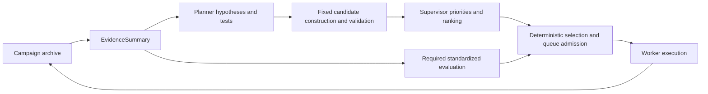

# Architecture

T-ReX separates adaptive scientific proposals from deterministic execution.
The LLM never launches an arbitrary command and cannot directly assign strict
success credit.

## Reading the campaign loop

Start with `campaign/cli.py` for the user workflow, `controller.py` for the
asynchronous campaign loop, and `live_tick.py` for one planning update. Follow
`candidate_builder.py`, `selector.py` and `execution/` for candidate jobs through
confirmed starts. For recorded results, begin with `schemas.py`, `archive.py`
and `analysis.py`. The [terminology glossary](terminology.md) maps manuscript
terms to stable implementation identifiers.

## Data plane

Backend-specific parsers translate generator, redesign, and canonical-scoring
outputs into frozen dataclasses from `schemas.py`. `archive.py` stores each
record type in a separate append-only JSONL stream. Record identifiers and
parent links preserve candidate lineage.

## Evidence plane

`evidence_reducer.py` composes focused modules under `evidence/` into an
`EvidenceSummary`. The route-value boundary is split into:

- `attribution.py` for canonical-SU eligibility, generating-record resolution,
  and lineage-cost ownership;
- `route_identity.py` for stable route keys, validated-config signatures, and
  human-facing route roles;
- `contracts.py` for the explicit configuration and diagnostic callback surface;
- `route_status.py` for deterministic lifetime and marginal policy labels; and
- `route_values.py` for typed accumulation followed by named aggregation,
  pending-score, exact-route, family-rollup, and bounded-ranking phases.

The reducer retains compatibility imports for existing callers, while the
focused route composer returns immutable `RouteValueSummary` rows. The complete
evidence summary contains:

- strict-gate pass/fail counts and per-axis margins;
- Foldseek structural bins and duplicate concentration;
- family- and exact-route yield and GPU cost;
- pending canonical-scoring volume and promising subsets;
- diagnostic confidence, interface, trajectory, and acceptance measurements;
- recent versus cumulative evidence windows;
- failures, timeouts, route occupancy, and uncertainty; and
- deterministic campaign-state classifications.

The summary is bounded for prompt use, while the complete source records remain
in the archive.

## Proposal plane

`planner.py` asks the Planner for evidence-linked hypotheses and follow-up tests.
Fixed code constructs and validates candidate jobs from these proposals.
`supervisor.py` asks the Supervisor for Rescue / Explore / eXploit allocation
proportions and an optional ranking of valid candidate jobs.
`critic_guard.py` provides the production deterministic, flag-only consistency
audit. `critic.py` retains the earlier LLM-critic implementation for explicit
research ablations; it is not the live production path.

## Control plane

`capability_registry.py` defines the allowed method families, roles, and
configuration ranges. `candidate_builder.py` compiles LLM suggestions and
bounded recovery candidates. `selector.py` realizes feasible actions while
preserving resource, concurrency, parent, lifecycle, and score-conversion
contracts. An LLM output outside this surface is rejected rather than executed.

`selection/` exposes deterministic Selector internals behind typed contracts.
`policy.py` resolves Supervisor versus fallback intent, clamp provenance,
global priority, and per-candidate modes. `admission.py` then applies hard
feasibility followed by capacity, family-cost, and exact-route deferrals.
`quota.py` realizes the continuous mode mixture with the configured seeded,
windowed, or fractional-credit strategy and applies productive momentum,
repeated-support, near-miss rescue, and marginal-diversity repairs in a fixed
order. Its typed result contains the raw and final quotas, persistent credit,
and repair audit trail. `ranking.py` owns quota-constrained ranking, batch
diversity, deferred backfill, and the bounded cross-family escape floor.
`emission.py` converts the result into stable launch/rejection records and
explains rank-1 or global-priority candidates that were not launched.
`selector.py` composes these typed stages and retains the evidence-derived
route-value bridge and backward-compatible debug projection.

## Live-tick orchestration

`tick/` exposes the reviewable phases that turn one archive snapshot into
audited launch decisions:

- `archive_snapshot.py` owns the append-order-preserving pre-tick read model,
  latest hypothesis views, warm-start coverage, bounded realized trajectory,
  and LLM-health history;
- `config.py` owns the shared immutable live-tick configuration contracts;
- `evidence_clustering.py` owns Foldseek/MMseqs cache calls, result-bin
  assignment, and complete deduplication provenance;
- `evidence.py` owns SU/new-SU accounting, collapse and dry-timer signals,
  production-panel snapshots, and immutable `EvidenceSummary` reduction;
- `proposal.py` owns Planner inputs, plan reuse, critic validation, and ordered
  audit records;
- `candidates.py` owns candidate construction inputs, parent-structure checks,
  refilter-lineage exclusions, and the feasible Selector population;
- `supervision.py` owns execution/cost context shown to the Supervisor, normal
  or reused decisions, and fallback propagation;
- `selection.py` derives mode hints and route saturation before invoking the
  deterministic Selector;
- `lifecycle.py` owns both descendant-free TTL retirement before the Planner
  and post-selection evaluation against concrete hypothesis baselines; and
- `summary.py` owns the stable evidence-only and full-tick output projections.

Every phase accepts a frozen request or immutable snapshot and returns an
inspectable result. `live_tick.py` retains ordered appends and the intentional
post-retirement hypothesis refresh as the composition root; initial archive
traversal is centralized in `archive_snapshot.py`. Of the extracted phases,
only clustering mutates in-memory `ResultRecord.bins`; it never writes to the
archive, and its contract documents that mutation explicitly.

## Execution plane

`campaign/runtime/paths.py` converts the optional user-facing `BackendPaths`
values into one immutable `RuntimePaths` snapshot. Campaign execution passes
that typed object directly to the controller; environment variables remain a
legacy/extension compatibility surface. Derived AF2 and ProteinMPNN locations
and the Foldseek/MMseqs commands therefore have one resolution point.

`backends/` owns built-in backend command construction, reviewable input-file
generation, deterministic per-campaign seeds, and shared subprocess isolation.
The AF2 refilter, BindCraft, BoltzGen, Complexa, and ProteinMPNN routes expose
typed launch descriptions before a process starts. Both synchronous
compatibility calls and live asynchronous launches consume the same builders,
which prevents scientifically meaningful settings from drifting between paths.

`execution/dispatch.py` owns the pending-candidate to running-worker transition:
queue admission, bounded retry, capacity defer, worker-slot assignment, and the
corresponding `DispatchRecord` audit. Scientific prioritization and concrete
backend launch functions are explicit dependencies, so the state machine is
testable without an LLM, GPU, or subprocess. `controller.py` retains a thin
compatibility wrapper for existing private imports.

`execution/worker_supervision.py` owns non-blocking completion reaping,
incremental BindCraft feedback, timeout decisions, salvage-before-terminate,
and campaign-shutdown draining. It returns typed reports, while parsing, audit
writes, extension timeout lookup, and process termination are explicit injected
operations.

`execution/circuit_breaker.py` owns the evidence-driven decision to disable a
persistently unproductive backend family. It builds lineage indexes once per
evaluation, protects the only remaining route-light generator, and returns an
immutable blocked-family and pending-queue delta. It does not mutate live
controller configuration or the archive.

`execution/progress_checkpoint.py` owns atomic controller checkpoint files and
the between-tick monitoring refresh. A typed request makes wall clocks, worker
occupancy, the previous state, and cadence explicit. Canonical score conversion
can request fresh evidence without an LLM call; other long-running work uses a
cheap wall-accounting snapshot. Failures retain the previous cadence and state
so the next poll can retry.

`execution/result_processing.py` owns output-directory resolution, parser
routing, duplicate filtering, elapsed GPU-hour attribution, chain metadata,
and synthetic no-artifact results. It returns typed, inspectable values and
does not write to the archive.

`execution/score_conversion_scheduling.py` determines which diagnostic
results still require canonical AF2 scoring, deduplicates and ranks eligible
parents, and returns typed follow-up candidates plus scheduling diagnostics.
It has no archive or process side effects, so score-conversion decisions can be
reproduced and tested independently from the live controller.

`controller.py` is the campaign composition root and maintains top-level
asynchronous sequencing. `live_tick.py` is the scientific-tick composition
root: it preserves archive append order while delegating proposal, validation,
supervision, selection, lifecycle, and output projection to `tick/`.

## Evaluation plane

`success_criteria.py` owns the fixed strict gate. `foldseek_clusterer.py` owns
structural deduplication; `sequence_clusterer.py` provides separate sequence
novelty evidence. Native generator scores are diagnostic and cannot bypass the
canonical gate.

## Analysis and export plane

`archive_schema.py` derives the machine-readable stream, field, and relationship
contract directly from the frozen record dataclasses and archive mapping.
`analysis.py` owns read-only summary, typed integrity validation, and
evidence-to-dispatch traces. `finalize_panel.py` owns structurally deduplicated
panel selection; `export_best_n.py` owns score-ranked structure copying. These
paths report their effective thresholds and versioned output schemas without
rewriting historical result records.
